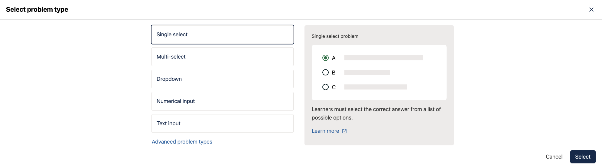
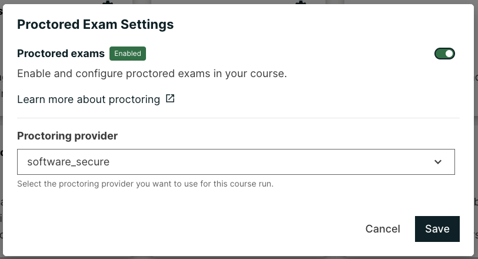
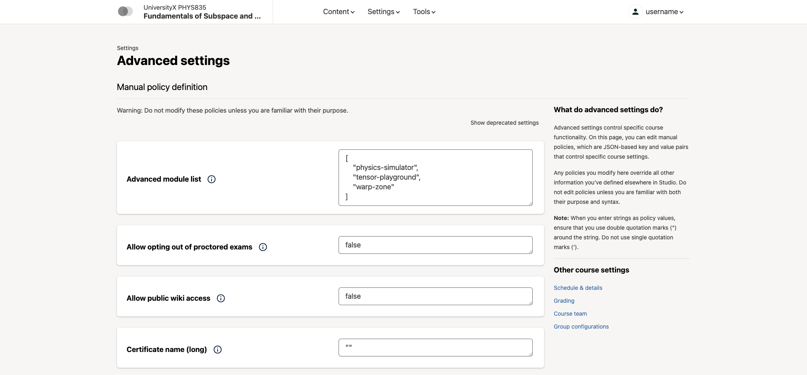
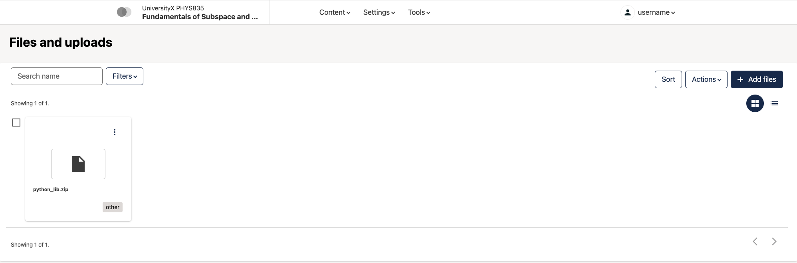
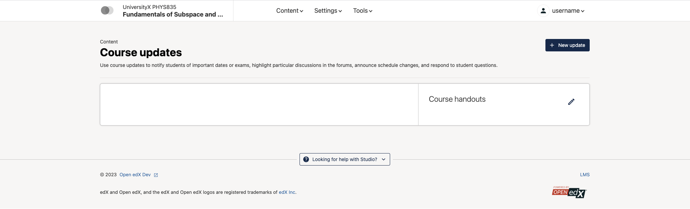
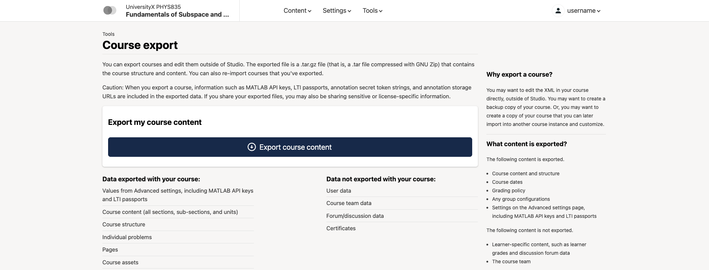
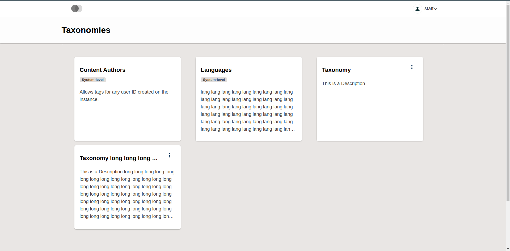

frontend-app-authoring
######################

|license-badge| |status-badge| |codecov-badge|

Purpose
*******

This implements most of the frontend for **Open edX Studio**, allowing authors to create and edit courses, libraries, and their learning components.

A few parts of Studio still default to the `"legacy" pages defined in edx-platform <https://github.com/openedx/edx-platform/tree/master/cms>`_, but those are rapidly being deprecated and replaced with the React- and Paragon-based pages defined here.

Getting Started
************

Prerequisites
=============

`Tutor`_ is currently recommended as a development environment for the Authoring
MFE. Most likely, it already has this MFE configured; however, you'll need to
make some changes in order to run it in development mode. You can refer
to the `relevant tutor-mfe documentation`_ for details, or follow the quick
guide below.

.. _Tutor: https://github.com/overhangio/tutor

.. _relevant tutor-mfe documentation: https://github.com/overhangio/tutor-mfe#mfe-development

Cloning and Setup
=================

1. Clone your new repo:

.. code-block:: bash

    git clone https://github.com/openedx/frontend-app-authoring.git

2. Use the version of Node specified in the ``.nvmrc`` file.

  The current version of the micro-frontend build scripts supports the version of Node found in ``.nvmrc``.
  Using other major versions of node *may* work, but this is unsupported.  For
  convenience, this repository includes an ``.nvmrc`` file to help in setting the
  correct node version via `nvm <https://github.com/nvm-sh/nvm>`_.

3. Stop the Tutor devstack, if it's running: ``tutor dev stop``

4. Next, we need to tell Tutor that we're going to be running this repo in
   development mode, and it should be excluded from the ``mfe`` container that
   otherwise runs every MFE. Run this:

.. code-block:: bash

    tutor mounts add /path/to/frontend-app-authoring

5. Start Tutor in development mode. This command will start the LMS and Studio,
   and other required MFEs like ``authn`` and ``account``, but will not start
   the Authoring MFE, which we're going to run on the host instead of in a
   container managed by Tutor. Run:

.. code-block:: bash

    tutor dev start lms cms mfe

Startup
=======

1. Install npm dependencies:

.. code-block:: bash

  cd frontend-app-authoring && npm ci

2. Start the dev server:

.. code-block:: bash

  npm run dev

Then you can access the app at http://apps.local.openedx.io:2001/course-authoring/home

Troubleshooting
---------------

* If you see an "Invalid Host header" error, then you're probably using a different domain name for your devstack such as
  ``local.edly.io`` or ``local.overhang.io`` (not the new recommended default, ``local.openedx.io``). In that case, run
  these commands to update your devstack's domain names:

.. code-block:: bash

  tutor dev stop
  tutor config save --set LMS_HOST=local.openedx.io --set CMS_HOST=studio.local.openedx.io
  tutor dev launch -I --skip-build
  tutor dev stop authoring  # We will run this MFE on the host

* If tutor-mfe is not starting the authoring MFE in development mode (eg. `tutor dev start authoring` fails), it may be due to
  using a tutor version that expects the MFE name to be frontend-app-course-authoring (the previous name of this repo). To fix
  this, you can rename the cloned repo directory to frontend-app-course-authoring. More information can be found in
  `this forum post <https://discuss.openedx.org/t/repo-rename-frontend-app-course-authoring-frontend-app-authoring/13930/2>`__.

Features
********

Feature: Pages and Resources Studio Tab
=======================================

Enables a "Pages & Resources" menu item in Studio, under the "Content" menu.

.. image:: ./docs/readme-images/feature-pages-resources.png

Requirements
------------

The following are requirements for this feature to function correctly:

* ``edx-platform`` Waffle flags:

  * ``discussions.pages_and_resources_mfe``: must be enabled for the set of users meant to access this feature.

* `frontend-app-learning <https://github.com/openedx/frontend-app-learning>`_: This MFE expects it to be the LMS frontend.
* `frontend-app-discussions <https://github.com/openedx/frontend-app-discussions/>`_: This is what the "Discussions" configuration provided by this feature actually configures.  Without it, discussion settings are ignored.

Configuration
-------------

In additional to the standard settings, the following local configuration items are required:

* ``LEARNING_BASE_URL``: points to Learning MFE; necessary so that the `View Live` button works
* ``ENABLE_PROGRESS_GRAPH_SETTINGS``: allow enabling or disabling the learner progress graph course-wide

Feature Description
-------------------

Clicking on the "Pages & Resources" menu item takes the user to the course's ``pages-and-resources`` standalone page in this MFE.  (In a devstack, for instance: http://localhost:2001/course/course-v1:edX+DemoX+Demo_Course/pages-and-resources.)

UX-wise, **Pages & Resources** is meant to look like a Studio tab, so reproduces Studio's header.

For a particular course, this page allows one to:

* Configure the new Discussions MFE (making this a requirement for it).  This includes:

  * Enabling/disabling the feature entirely
  * Picking a different discussion provider, while showing a comparison matrix between them:

    * edX
    * Ed Discussion
    * InScribe
    * Piazza
    * Yellowdig

  * Allowing to configure the selected provider

* Enable/Disable learner progress
* Enable/Disable learner notes
* Enable/Disable the learner wiki
* Enable/Disable the LMS calculator
* Go to the textbook management page in Studio (in a devstack: http://localhost:18010/textbooks/course-v1:edX+DemoX+Demo_Course)
* Go to the custom page management page in Studio(in a devstack http://localhost:18010/tabs/course-v1:edX+DemoX+Demo_Course)

Feature: New React XBlock Editors
=================================

New React editors for the HTML, Video, and Problem XBlocks are provided here and are rendered by this MFE instead of by the XBlock's authoring view.

Feature: New Proctoring Exams View
==================================

Requirements
------------

* `edx-exams <https://github.com/edx/edx-exams>`_: for this feature to work, the ``edx-exams`` IDA must be deployed and its API accessible by the browser

Configuration
-------------

In additional to the standard settings, the following local configuration item is required:

* ``EXAMS_BASE_URL``: URL to the ``edx-exams`` deployment

Feature Description
-------------------

In Studio, a new item ("Proctored Exam Settings") is added to "Other Course Settings" in the course's "Certificates" settings page.  When clicked, this takes the author to the corresponding page in the Course Authoring MFE, where one can:

* Enable proctored exams for the course
* Allow opting out of proctored exams
* Select a proctoring provider

Feature: Advanced Settings
==========================

In Studio, the "Advanced Settings" page for each enabled course will now be served by this frontend, instead of the UI built into edx-platform. The advanced settings page holds many different settings for the course, such as what features or XBlocks are enabled.

Feature: Files & Uploads
==========================

In Studio, the "Files & Uploads" page for each enabled course will now be served by this frontend, instead of the UI built into edx-platform. This page allows managing static asset files like PDFs, images, etc. used for the course.

Feature: Course Updates
==========================

Feature: Import/Export Pages
============================

Feature: Tagging/Taxonomy Pages
================================

Requirements
------------

* ``edx-platform`` Waffle flags:

  * ``new_studio_mfe.use_tagging_taxonomy_list_page``: this feature flag must be enabled.

Configuration
-------------

In additional to the standard settings, the following local configuration items are required:

* ``ENABLE_TAGGING_TAXONOMY_PAGES``: must be enabled (which it is by default) in order to actually enable/show the new
Tagging/Taxonomy functionality.

Feature: Libraries V2/Legacy Tabs
=================================

Configuration
-------------

In additional to the standard settings, the following local configurations can be set to switch between different library modes:

* ``MEILISEARCH_ENABLED``: Studio setting which is enabled when the `meilisearch plugin`_ is installed.
* ``edx-platform`` Waffle flags:

  * ``contentstore.new_studio_mfe.disable_legacy_libraries``: this feature flag must be OFF to show legacy Libraries V1
  * ``contentstore.new_studio_mfe.disable_new_libraries``: this feature flag must be OFF to show Content Libraries V2

.. _meilisearch plugin: https://github.com/open-craft/tutor-contrib-meilisearch

Developing
**********

`Tutor <https://docs.tutor.edly.io/>`_ is the community-supported Open edX development environment. See the `tutor-mfe plugin README <https://github.com/overhangio/tutor-mfe?tab=readme-ov-file#mfe-development>`_ for more information.

If your devstack includes the default Demo course, you can visit the following URLs to see content:

- `Pages and Resources <http://localhost:2001/course/course-v1:edX+DemoX+Demo_Course/pages-and-resources>`_

Troubleshooting
========================

* ``npm ERR! gyp ERR! build error`` while running npm install on Macs with M1 processors: Probably due to a compatibility issue of node-canvas with M1.

  Run ``brew install pkg-config pixman cairo pango libpng jpeg giflib librsvg`` before ``npm install`` to get the correct versions of the dependencies.
  If there is still an error, look for "no package [...] found" in the error message and install missing package via brew.
  (https://github.com/Automattic/node-canvas/issues/1733)

Deploying
*********

Production Build
================

The production build is created with ``npm run build``.

.. |Build Status| image:: https://api.travis-ci.com/edx/frontend-app-course-authoring.svg?branch=master
   :target: https://travis-ci.com/edx/frontend-app-course-authoring
.. |Codecov| image:: https://codecov.io/gh/edx/frontend-app-course-authoring/branch/master/graph/badge.svg
   :target: https://codecov.io/gh/edx/frontend-app-course-authoring
.. |license| image:: https://img.shields.io/npm/l/@edx/frontend-app-authoring.svg
   :target: @edx/frontend-app-authoring

Internationalization
====================

Please see refer to the `frontend-platform i18n howto`_ for documentation on
internationalization.

.. _frontend-platform i18n howto: https://github.com/openedx/frontend-platform/blob/master/docs/how_tos/i18n.rst

Getting Help
************

If you're having trouble, we have discussion forums at
https://discuss.openedx.org where you can connect with others in the community.

Our real-time conversations are on Slack. You can request a `Slack
invitation`_, then join our `community Slack workspace`_.  Because this is a
frontend repository, the best place to discuss it would be in the `#wg-frontend
channel`_.

For anything non-trivial, the best path is to open an issue in this repository
with as many details about the issue you are facing as you can provide.

https://github.com/openedx/frontend-app-course-authoring/issues

For more information about these options, see the `Getting Help`_ page.

.. _Slack invitation: https://openedx.org/slack
.. _community Slack workspace: https://openedx.slack.com/
.. _#wg-frontend channel: https://openedx.slack.com/archives/C04BM6YC7A6
.. _Getting Help: https://openedx.org/community/connect

Legacy Studio
*************

If you would like to use legacy studio for certain features, you can set the following waffle flags in ``edx-platform``:
  * ``legacy_studio.text_editor``: loads the legacy HTML Xblock editor when editing a text block
  * ``legacy_studio.video_editor``: loads the legacy Video editor when editing a video block
  * ``legacy_studio.problem_editor``: loads the legacy Problem editor when editing a problem block
  * ``legacy_studio.advanced_settings``: Advanced Settings page
  * ``legacy_studio.updates``: Updates page
  * ``legacy_studio.export``: Export page
  * ``legacy_studio.import``: Import page
  * ``legacy_studio.files_uploads``: Files page
  * ``legacy_studio.exam_settings``: loads the legacy Exam Settings

License
*******

The code in this repository is licensed under the AGPLv3 unless otherwise
noted.

Please see `LICENSE <LICENSE>`_ for details.

Contributing
************

Contributions are very welcome.  Please read `How To Contribute`_ for details.

.. _How To Contribute: https://openedx.org/r/how-to-contribute

This project is currently accepting all types of contributions, bug fixes,
security fixes, maintenance work, or new features.  However, please make sure
to have a discussion about your new feature idea with the maintainers prior to
beginning development to maximize the chances of your change being accepted.
You can start a conversation by creating a new issue on this repo summarizing
your idea.

The Open edX Code of Conduct
****************************

All community members are expected to follow the `Open edX Code of Conduct`_.

.. _Open edX Code of Conduct: https://openedx.org/code-of-conduct/

People
******

The assigned maintainers for this component and other project details may be
found in `Backstage`_. Backstage pulls this data from the ``catalog-info.yaml``
file in this repo.

.. _Backstage: https://open-edx-backstage.herokuapp.com/catalog/default/component/frontend-app-course-authoring

Reporting Security Issues
*************************

Please do not report security issues in public, and email security@openedx.org instead.

.. |license-badge| image:: https://img.shields.io/github/license/openedx/frontend-app-course-authoring.svg
    :target: https://github.com/openedx/frontend-app-course-authoring/blob/master/LICENSE
    :alt: License

.. |status-badge| image:: https://img.shields.io/badge/Status-Maintained-brightgreen

.. |codecov-badge| image:: https://codecov.io/github/openedx/frontend-app-course-authoring/coverage.svg?branch=master
    :target: https://codecov.io/github/openedx/frontend-app-course-authoring?branch=master
    :alt: Codecov
