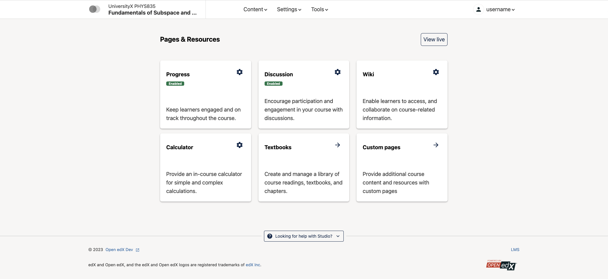

frontend-app-course-authoring
#############################

|license-badge| |status-badge| |codecov-badge|

Purpose
*******

This is the Course Authoring micro-frontend, currently under development by `2U <https://2u.com>`_.

Its purpose is to provide both a framework and UI for new or replacement React-based authoring features outside ``edx-platform``.  You can find the current set described below.

Getting Started
************

Prerequisites
=============

The `devstack`_ is currently recommended as a development environment for your
new MFE.  If you start it with ``make dev.up.lms`` that should give you
everything you need as a companion to this frontend.

Note that it is also possible to use `Tutor`_ to develop an MFE.  You can refer
to the `relevant tutor-mfe documentation`_ to get started using it.

.. _Devstack: https://github.com/openedx/devstack

.. _Tutor: https://github.com/overhangio/tutor

.. _relevant tutor-mfe documentation: https://github.com/overhangio/tutor-mfe#mfe-development

Configuration
=============

All features that integrate into the edx-platform CMS require that the ``COURSE_AUTHORING_MICROFRONTEND_URL`` Django setting is set in the CMS environment and points to this MFE's deployment URL. This should be done automatically if you are using devstack or tutor-mfe.

Cloning and Startup
===================

1. Clone the repo:

  ``git clone https://github.com/openedx/frontend-app-course-authoring.git``

2. Use node v18.x.

   The current version of the micro-frontend build scripts support node 18.
   Using other major versions of node *may* work, but this is unsupported.  For
   convenience, this repository includes an .nvmrc file to help in setting the
   correct node version via `nvm use`_.

3. Install npm dependencies:

  ``cd frontend-app-course-authoring && npm install``

4. Start the dev server:

  ``npm start``

The dev server is running at `http://localhost:2001 <http://localhost:2001>`_.
or whatever port you setup.

Features
********

Feature: Pages and Resources Studio Tab
=======================================

Enables a "Pages & Resources" menu item in Studio, under the "Content" menu.

Requirements
------------

The following are requirements for this feature to function correctly:

* ``edx-platform`` Waffle flags:

  * ``discussions.pages_and_resources_mfe``: must be enabled for the set of users meant to access this feature.

* `frontend-app-learning <https://github.com/openedx/frontend-app-learning>`_: This MFE expects it to be the LMS frontend.
* `frontend-app-discussions <https://github.com/openedx/frontend-app-discussions/>`_: This is what the "Discussions" configuration provided by this feature actually configures.  Without it, discussion settings are ignored.

Configuration
-------------

In additional to the standard settings, the following local configuration items are required:

* ``LEARNING_BASE_URL``: points to Learning MFE; necessary so that the `View Live` button works
* ``ENABLE_PROGRESS_GRAPH_SETTINGS``: allow enabling or disabling the learner progress graph course-wide

Feature Description
-------------------

Clicking on the "Pages & Resources" menu item takes the user to the course's ``pages-and-resources`` standalone page in this MFE.  (In a devstack, for instance: http://localhost:2001/course/course-v1:edX+DemoX+Demo_Course/pages-and-resources.)

UX-wise, **Pages & Resources** is meant to look like a Studio tab, so reproduces Studio's header.

For a particular course, this page allows one to:

* Configure the new Discussions MFE (making this a requirement for it).  This includes:

  * Enabling/disabling the feature entirely
  * Picking a different discussion provider, while showing a comparison matrix between them:

    * edX
    * Ed Discussion
    * InScribe
    * Piazza
    * Yellowdig

  * Allowing to configure the selected provider

* Enable/Disable learner progress
* Enable/Disable learner notes
* Enable/Disable the learner wiki
* Enable/Disable the LMS calculator
* Go to the textbook management page in Studio (in a devstack: http://localhost:18010/textbooks/course-v1:edX+DemoX+Demo_Course)
* Go to the custom page management page in Studio(in a devstack http://localhost:18010/tabs/course-v1:edX+DemoX+Demo_Course)

Feature: New React XBlock Editors
=================================

This allows an operator to enable the use of new React editors for the HTML, Video, and Problem XBlocks, all of which are provided here.

Requirements
------------

* ``edx-platform`` Waffle flags:

  * ``new_core_editors.use_new_text_editor``: must be enabled for the new HTML Xblock editor to be used in Studio
  * ``new_core_editors.use_new_video_editor``: must be enabled for the new Video Xblock editor to be used in Studio
  * ``new_core_editors.use_new_problem_editor``: must be enabled for the new Problem Xblock editor to be used in Studio

Feature Description
-------------------

When a corresponding waffle flag is set, upon editing a block in Studio, the view is rendered by this MFE instead of by the XBlock's authoring view.  The user remains in Studio.

.. note::

   The new editors themselves are currently implemented in a repository outside ``openedx``: `frontend-lib-content-components <https://github.com/edx/frontend-lib-content-components/>`_, a dependency of this MFE.  This repository is slated to be moved to the ``openedx`` org, however.

Feature: New Proctoring Exams View
==================================

Requirements
------------

* ``edx-platform`` Django settings:

  * ``ZENDESK_*``: necessary if automatic ZenDesk ticket creation is desired

* ``edx-platform`` Feature flags:

  * ``ENABLE_EXAM_SETTINGS_HTML_VIEW``: this feature flag must be enabled for the link to the settings view to be shown

* `edx-exams <https://github.com/edx/edx-exams>`_: for this feature to work, the ``edx-exams`` IDA must be deployed and its API accessible by the browser

Configuration
-------------

In additional to the standard settings, the following local configuration item is required:

* ``EXAMS_BASE_URL``: URL to the ``edx-exams`` deployment

Feature Description
-------------------

In Studio, a new item ("Proctored Exam Settings") is added to "Other Course Settings" in the course's "Certificates" settings page.  When clicked, this takes the author to the corresponding page in the Course Authoring MFE, where one can:

* Enable proctored exams for the course
* Allow opting out of proctored exams
* Select a proctoring provider
* Enable automatic creation of Zendesk tickets for "suspicious" proctored exam attempts

Feature: Advanced Settings
==========================

Requirements
------------

* ``edx-platform`` Waffle flags:

  * ``contentstore.new_studio_mfe.use_new_advanced_settings_page``: this feature flag must be enabled for the link to the settings view to be shown. It can be enabled on a per-course basis.

Feature Description
-------------------

In Studio, the "Advanced Settings" page for each enabled course will now be served by this frontend, instead of the UI built into edx-platform. The advanced settings page holds many different settings for the course, such as what features or XBlocks are enabled.

Feature: Files & Uploads
==========================

Requirements
------------

* ``edx-platform`` Waffle flags:

  * ``contentstore.new_studio_mfe.use_new_files_uploads_page``: this feature flag must be enabled for the link to the Files & Uploads page to go to the MFE. It can be enabled on a per-course basis.

Feature Description
-------------------

In Studio, the "Files & Uploads" page for each enabled course will now be served by this frontend, instead of the UI built into edx-platform. This page allows managing static asset files like PDFs, images, etc. used for the course.

Feature: Course Updates
==========================

.. image:: ./docs/readme-images/feature-course-updates.png

Requirements
------------

* ``edx-platform`` Waffle flags:

  * ``contentstore.new_studio_mfe.use_new_updates_page``: this feature flag must be enabled.

Feature: Import/Export Pages
============================

.. image:: ./docs/readme-images/feature-export.png

Requirements
------------

* ``edx-platform`` Waffle flags:

  * ``contentstore.new_studio_mfe.use_new_export_page``: this feature flag will change the CMS to link to the new export page.
  * ``contentstore.new_studio_mfe.use_new_import_page``: this feature flag will change the CMS to link to the new import page.

Feature: Tagging/Taxonomy Pages
================================

.. image:: ./docs/readme-images/feature-tagging-taxonomy-pages.png

Requirements
------------

* ``edx-platform`` Waffle flags:

  * ``new_studio_mfe.use_tagging_taxonomy_list_page``: this feature flag must be enabled.

Configuration
-------------

In additional to the standard settings, the following local configuration items are required:

* ``ENABLE_TAGGING_TAXONOMY_PAGES``: must be enabled (which it is by default) in order to actually enable/show the new 
Tagging/Taxonomy functionality.

Feature: Libraries V2/Legacy Tabs
=================================

Configuration
-------------

In additional to the standard settings, the following local configurations can be set to switch between different library modes:

* ``LIBRARY_MODE``: can be set to ``mixed`` (default for development), ``v1 only`` (default for production) and ``v2 only``.

  * ``mixed``: Shows 2 tabs, "Libraries" that lists the v2 libraries and "Legacy Libraries" that lists the v1 libraries. When creating a new library in this mode it will create a new v2 library.
  * ``v1 only``: Shows only 1 tab, "Libraries" that lists v1 libraries only. When creating a new library in this mode it will create a new v1 library.
  * ``v2 only``: Shows only 1 tab, "Libraries" that lists v2 libraries only. When creating a new library in this mode it will create a new v2 library.

Developing
**********

`Devstack <https://edx.readthedocs.io/projects/edx-installing-configuring-and-running/en/latest/installation/index.html>`_.  If you start Devstack with ``make dev.up.studio`` that should give you everything you need as a companion to this frontend.

If your devstack includes the default Demo course, you can visit the following URLs to see content:

- `Pages and Resources <http://localhost:2001/course/course-v1:edX+DemoX+Demo_Course/pages-and-resources>`_

Troubleshooting
========================

* ``npm ERR! gyp ERR! build error`` while running npm install on Macs with M1 processors: Probably due to a compatibility issue of node-canvas with M1.
  
  Run ``brew install pkg-config pixman cairo pango libpng jpeg giflib librsvg`` before ``npm install`` to get the correct versions of the dependencies.
  If there is still an error, look for "no package [...] found" in the error message and install missing package via brew.
  (https://github.com/Automattic/node-canvas/issues/1733)

Deploying
*********

Production Build
================

The production build is created with ``npm run build``.

.. |Build Status| image:: https://api.travis-ci.com/edx/frontend-app-course-authoring.svg?branch=master
   :target: https://travis-ci.com/edx/frontend-app-course-authoring
.. |Codecov| image:: https://codecov.io/gh/edx/frontend-app-course-authoring/branch/master/graph/badge.svg
   :target: https://codecov.io/gh/edx/frontend-app-course-authoring
.. |license| image:: https://img.shields.io/npm/l/@edx/frontend-app-course-authoring.svg
   :target: @edx/frontend-app-course-authoring

Internationalization
====================

Please see refer to the `frontend-platform i18n howto`_ for documentation on
internationalization.

.. _frontend-platform i18n howto: https://github.com/openedx/frontend-platform/blob/master/docs/how_tos/i18n.rst

Getting Help
************

If you're having trouble, we have discussion forums at
https://discuss.openedx.org where you can connect with others in the community.

Our real-time conversations are on Slack. You can request a `Slack
invitation`_, then join our `community Slack workspace`_.  Because this is a
frontend repository, the best place to discuss it would be in the `#wg-frontend
channel`_.

For anything non-trivial, the best path is to open an issue in this repository
with as many details about the issue you are facing as you can provide.

https://github.com/openedx/frontend-app-course-authoring/issues

For more information about these options, see the `Getting Help`_ page.

.. _Slack invitation: https://openedx.org/slack
.. _community Slack workspace: https://openedx.slack.com/
.. _#wg-frontend channel: https://openedx.slack.com/archives/C04BM6YC7A6
.. _Getting Help: https://openedx.org/community/connect

License
*******

The code in this repository is licensed under the AGPLv3 unless otherwise
noted.

Please see `LICENSE <LICENSE>`_ for details.

Contributing
************

Contributions are very welcome.  Please read `How To Contribute`_ for details.

.. _How To Contribute: https://openedx.org/r/how-to-contribute

This project is currently accepting all types of contributions, bug fixes,
security fixes, maintenance work, or new features.  However, please make sure
to have a discussion about your new feature idea with the maintainers prior to
beginning development to maximize the chances of your change being accepted.
You can start a conversation by creating a new issue on this repo summarizing
your idea.

The Open edX Code of Conduct
****************************

All community members are expected to follow the `Open edX Code of Conduct`_.

.. _Open edX Code of Conduct: https://openedx.org/code-of-conduct/

People
******

The assigned maintainers for this component and other project details may be
found in `Backstage`_. Backstage pulls this data from the ``catalog-info.yaml``
file in this repo.

.. _Backstage: https://open-edx-backstage.herokuapp.com/catalog/default/component/frontend-app-course-authoring

Reporting Security Issues
*************************

Please do not report security issues in public, and email security@openedx.org instead.

.. |license-badge| image:: https://img.shields.io/github/license/openedx/frontend-app-course-authoring.svg
    :target: https://github.com/openedx/frontend-app-course-authoring/blob/master/LICENSE
    :alt: License

.. |status-badge| image:: https://img.shields.io/badge/Status-Maintained-brightgreen

.. |codecov-badge| image:: https://codecov.io/github/openedx/frontend-app-course-authoring/coverage.svg?branch=master
    :target: https://codecov.io/github/openedx/frontend-app-course-authoring?branch=master
    :alt: Codecov
