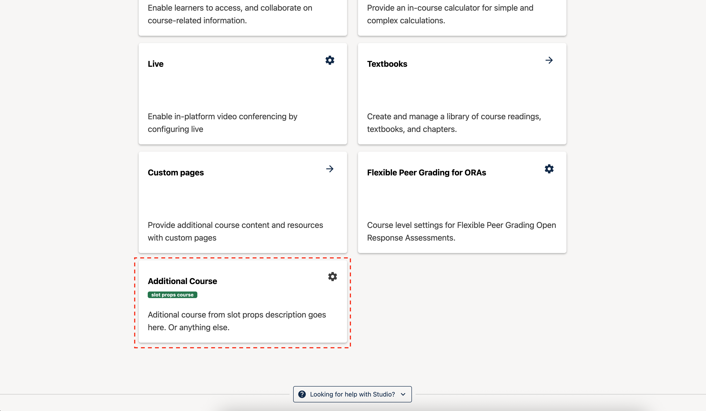

# Additional Course Plugin Slot

### Slot ID: `org.openedx.frontend.authoring.additional_course_plugin.v1`

### Slot ID Aliases
* `additional_course_plugin`

## Description

This slot is used to add a custom card on the the page & resources page.

## Example

The following `env.config.jsx` will add a custom card at the end of the page & resources section.



```jsx
import { DIRECT_PLUGIN, PLUGIN_OPERATIONS } from '@openedx/frontend-plugin-framework';
import { Badge, Card } from '@openedx/paragon';
import { Settings } from '@openedx/paragon/icons';

const config = {
  pluginSlots: {
    'org.openedx.frontend.authoring.additional_course_plugin.v1': {
      plugins: [
        {
          op: PLUGIN_OPERATIONS.Hide,
          widgetId: 'default_contents',
        },
        {
          op: PLUGIN_OPERATIONS.Insert,
          widget: {
            id: 'custom_additional_course',
            type: DIRECT_PLUGIN,
            RenderWidget: () => (
                <Card className={'shadow justify-content-between'} >
                    <Card.Header
                        title={'Additional Course'}
                        subtitle={(
                        <Badge variant="success" className="mt-1">
                          slot props course
                        </Badge>
                        )}
                        actions={<Settings />}
                        size="sm"
                    />
                    <Card.Body>
                        <Card.Section>
                          Additional course from slot props description. 
                          Or anything else.
                        </Card.Section>
                    </Card.Body>
                </Card>
            ),
          },
        },
      ]
    }
  },
}

export default config;
```