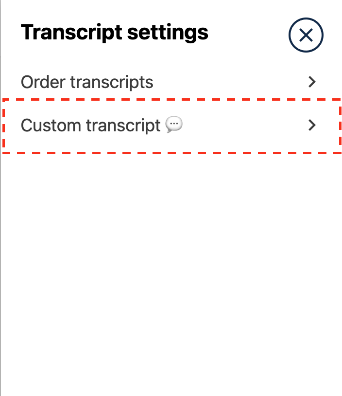

# AdditionalTranslationsComponentSlot

### Slot ID: `org.openedx.frontend.authoring.video_transcript_additional_translations_component.v1`

### Slot ID Aliases
* `additonal_translations_component_slot` (original misspelling)
* `additional_translations_component_slot`

### Plugin Props:
* `setIsAiTranslations` - Function (React SetState)
* `closeTranscriptSettings` - Function (Paragon useToggle)
* `courseId` - String
* `additionalProps` - Object
  * `transcriptType` - String
  * `isAiTranslationsEnabled` - Boolean

 
## Description

This slot is used to add a custom block in the **Video Transcription Settings** drawer.

## Example

The following `env.config.jsx` will add a custom transcript option in the Transcript Settings drawer.



```jsx
import { DIRECT_PLUGIN, PLUGIN_OPERATIONS } from '@openedx/frontend-plugin-framework';
import { Collapsible, Icon } from '@openedx/paragon';
import { ChevronRight } from '@openedx/paragon/icons';

const TranslationsBlock = ({ setIsAiTranslations, courseId }) => (
  <div key="transcript-type-selection" className="mt-3">
    <Collapsible.Advanced
      onOpen={() => setIsAiTranslations(courseId === 'anyId')}
    >
      <Collapsible.Trigger
        className="row m-0 justify-content-between align-items-center"
      >
        Custom transcript 💬
        <Icon src={ChevronRight} />
      </Collapsible.Trigger>
    </Collapsible.Advanced>
  </div>
);

const config = {
  pluginSlots: {
    'org.openedx.frontend.authoring.video_transcript_additional_translations_component.v1': {
      plugins: [
        {
          op: PLUGIN_OPERATIONS.Insert,
          widget: {
            id: 'custom_additional_translation_id',
            type: DIRECT_PLUGIN,
            RenderWidget: TranslationsBlock,
          },
        },
      ],
    },
  },
}

export default config;
```
