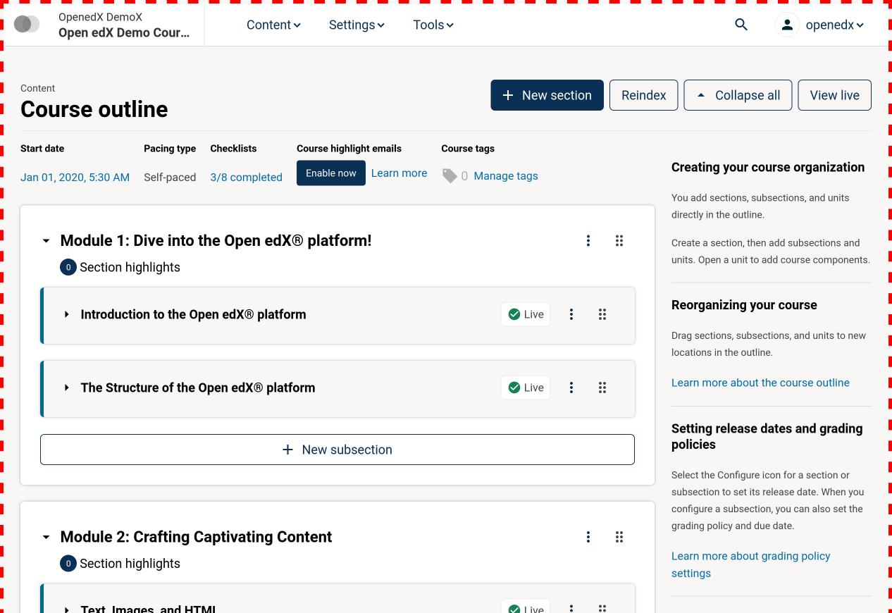

# AuthoringAppSlot

### Slot ID: `authoring_app_slot`

### Plugin Props:

NONE

## Description

The slot wraps the entire application. It can be used to add content before or
after the application (such as cookie banners) or to wrap the entire
application in a component. One possible use case of that is to wrap the entire
application in a context manager that would allow communication between
different slots injected on the page.

## Example



The following example configuration wraps the entire app in a dashed border as
shown above.

```js
import { PLUGIN_OPERATIONS } from '@openedx/frontend-plugin-framework';

const config = {
  pluginSlots: {
    authoring_app_slot: {
      keepDefault: true,
      plugins: [
        {
          op: PLUGIN_OPERATIONS.Wrap,
          widgetId: 'default_contents',
          wrapper: ({ component }) => (
            <div style={{ border: 'thick dashed red' }}>{component}</div>
          ),
        },
      ],
    },
  }
};
export default config;
```
