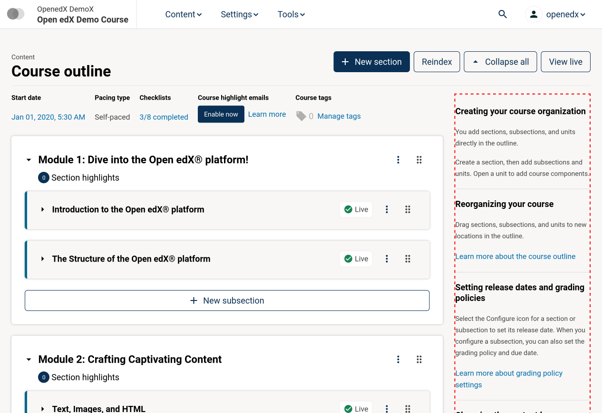

# CourseAuthoringOutlineSidebarSlot

### Slot ID: `course_authoring_outline_sidebar_slot`

### Plugin Props:

* `courseId` - String. 

## Description

The slot wraps the sidebar that is displayed on the course outline page. It can
be used to add additional sidebar components or modify the existing sidebar.

## Example



The following example configuration surrounds the sidebar in a border as shown above.

```js
import { PLUGIN_OPERATIONS } from '@openedx/frontend-plugin-framework';

const config = {
  pluginSlots: {
    course_authoring_outline_sidebar_slot: {
      keepDefault: true,
      plugins: [
        {
          op: PLUGIN_OPERATIONS.Wrap,
          widgetId: 'default_contents',
          wrapper: ({ component }) => (
            <div style={{ border: 'thick dashed red' }}>{component}</div>
          ),
        },
      ],
    },
  }
};
export default config;
```
