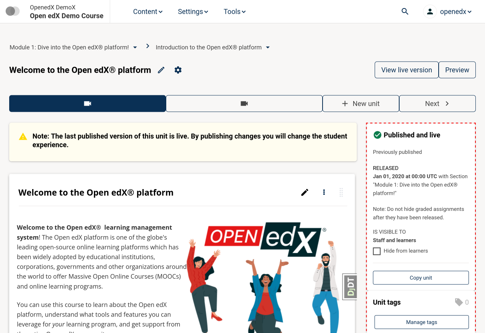
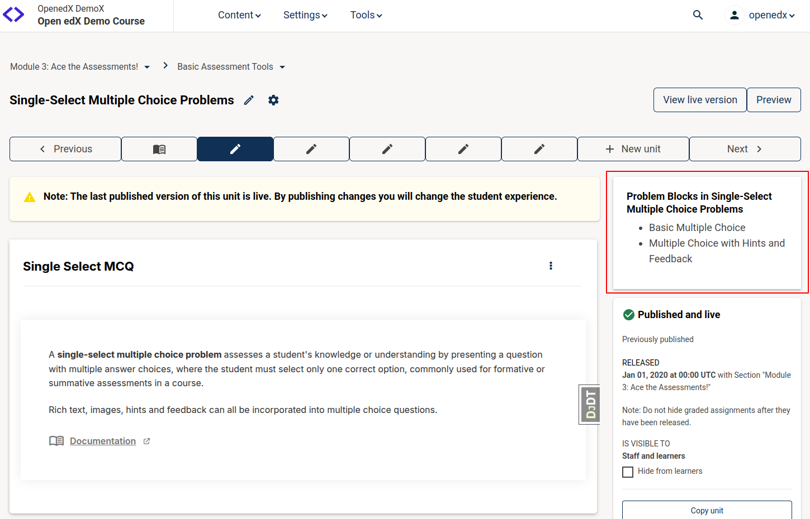

# CourseAuthoringUnitSidebarSlot

### Slot ID: `org.openedx.frontend.authoring.course_unit_sidebar.v1`

### Slot ID Aliases: `course_authoring_unit_sidebar_slot`

### Plugin Props:

* `courseId` - String.
* `blockId` - String. The usage id of the current unit being viewed / edited.
* `unitTitle` - String. The name of the current unit being viewed / edited.
* `xBlocks` - Array of Objects. List of XBlocks in the Unit. Object structure defined in `index.tsx`.
* `readOnly` - Boolean. True if the user should not be able to edit the contents of the unit.

### Description

The slot wraps the sidebar that is displayed on the unit editor page. It can
be used to add additional sidebar components or modify the existing sidebar.

> [!IMPORTANT]
> This document describes an older version `v1` of the `CourseAuthoringUnitSidebarSlot`.
> It is recommended to use the `org.openedx.frontend.authoring.course_unit_sidebar.v2` slot ID for new plugins.

The `v1` slot has the following limitations compared to the `v2` version:
* It renders conditionally based on the `isUnitVerticalType` prop, which means the plugins won't be rendered in other scenarios like unit with library blocks.
* It does **not** wrap the `SplitTestSidebarInfo` component. So it can't be hidden from the sidebar by overriding the components in the slot.
* As it is not the primary child component of the sidebar, CSS styling for inserted components face limitations, such as an inability to be `sticky` or achieve 100% height.

## Example 1



The following example configuration surrounds the sidebar in a border as shown above.

```js
import { PLUGIN_OPERATIONS } from '@openedx/frontend-plugin-framework';

const config = {
  pluginSlots: {
    'org.openedx.frontend.authoring.course_unit_sidebar.v1': {
      keepDefault: true,
      plugins: [
        {
          op: PLUGIN_OPERATIONS.Wrap,
          widgetId: 'default_contents',
          wrapper: ({ component }) => (
            <div style={{ border: 'thick dashed red' }}>{component}</div>
          ),
        },
      ],
    },
  }
};
export default config;
```

## Example 2



```js
import { PLUGIN_OPERATIONS, DIRECT_PLUGIN  } from '@openedx/frontend-plugin-framework';

const ProblemBlocks = ({unitTitle, xBlocks}) => (
  <>
    <h4 className="h4">{unitTitle}: Problem Blocks</h4>
    <ul>
      {xBlocks
        .filter(block => block.blockType === "problem")
        .map(block => <li key={block.id}>{block.displayName}</li>)
      }
    </ul>
  </>
);

const config = {
  pluginSlots: {
    'org.openedx.frontend.authoring.course_unit_sidebar.v1': {
      keepDefault: true,
      plugins: [
        {
          op: PLUGIN_OPERATIONS.Insert,
          widget:{
            id: 'problem-blocks-list',
            priority: 1,
            type: DIRECT_PLUGIN,
            RenderWidget: ProblemBlocks,
          }
        },
      ],
    },
  }
};
export default config;
```
