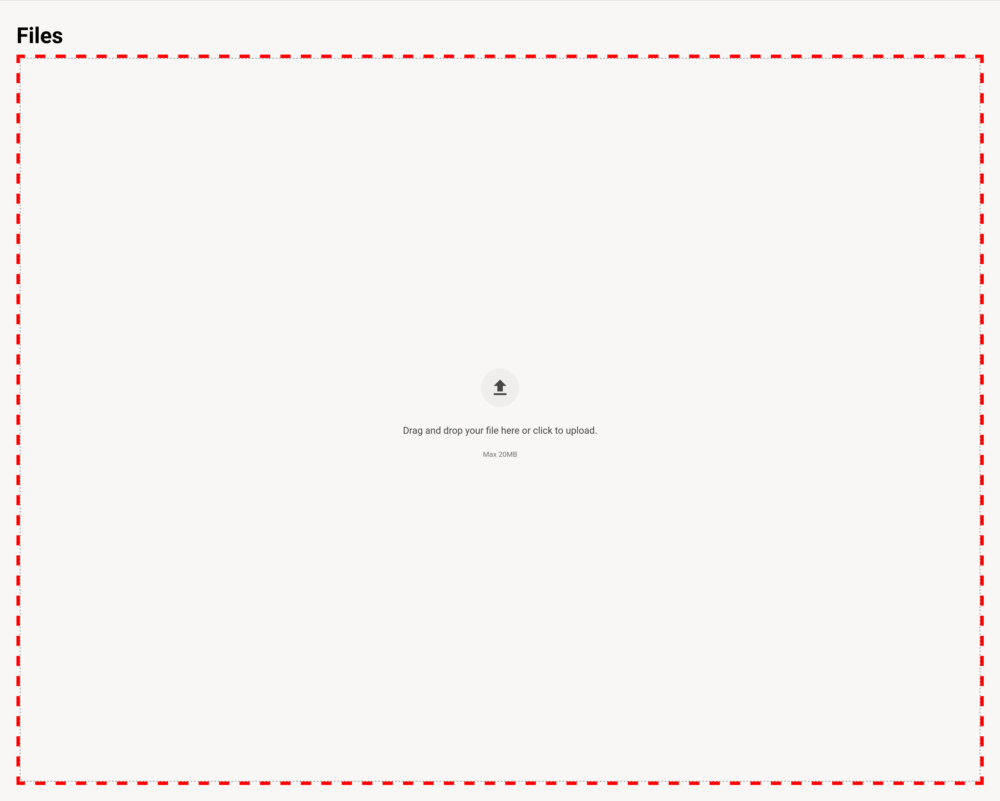

# Course Files Slot

### Slot ID: `org.openedx.frontend.authoring.files_upload_page_table.v1`

## Description

This slot is used to replace/modify/hide the course file table UI.

## Example

### Wrapped with a div with dashed border



The following `env.config.jsx` will wrap the files component with a div that has a large dashed
red border.

```js
import { PLUGIN_OPERATIONS } from '@openedx/frontend-plugin-framework';

const config = {
  pluginSlots: {
    'org.openedx.frontend.authoring.files_upload_page_table.v1': {
      keepDefault: true,
      plugins: [
        {
          op: PLUGIN_OPERATIONS.Wrap,
          widgetId: 'default_contents',
          wrapper: ({component}) =>  (
            <div style={{border:'thick dashed red'}}>
            {component}
            </div>
          )
        },
      ]
    }
  },
}

export default config;
```
