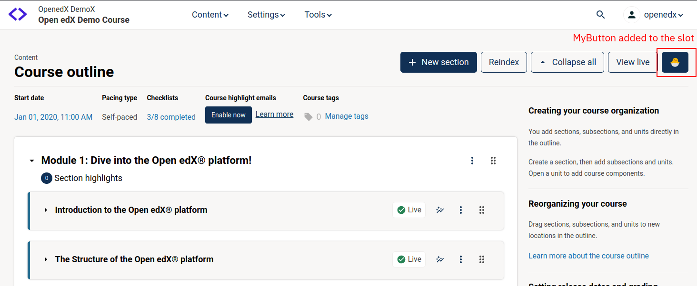

# CourseOutlineHeaderActionsSlot

### Slot ID: `org.openedx.frontend.authoring.course_outline_header_actions.v1`

### Slot ID Aliases
* `course_outline_header_actions_slot`

### Plugin Props:

* `isReIndexShow` - Boolean.
* `isSectionsExpanded` - Boolean.
* `headerNavigationsActions` - Object. See Proptypes definition in the component for details.
* `hasSections` - Boolean. Indicates if the course outline has sections.
* `courseActions` - Object. See Proptypes definition in the component for details.
* `errors` - Object. See Proptypes definition in the component for details.
* `sections` - Array of objects. Sections of the course outline.

## Description

The slot is positioned in the `SubHeader` section of the Course Outline page, suitable for adding action buttons.

The slot by default contains the action buttons such as `+ New Section`, `Reindex`, `View Live`.

## Example



The following example configuration inserts an extra button to the header as shown above.

```js
import { DIRECT_PLUGIN, PLUGIN_OPERATIONS } from '@openedx/frontend-plugin-framework';
import { Button } from '@openedx/paragon';

const MyButton = () => (
  <Button>🐣</Button>
);

const config = {
  pluginSlots: {
    'org.openedx.frontend.authoring.course_outline_header_actions.v1': {
      keepDefault: true,
      plugins: [
        {
          op: PLUGIN_OPERATIONS.Insert,
          widget: {
            id: 'my-extra-button',
            priority: 60,
            type: DIRECT_PLUGIN,
            RenderWidget: MyButton,
          },
        },
      ]
    }
  },
}

export default config;
```

