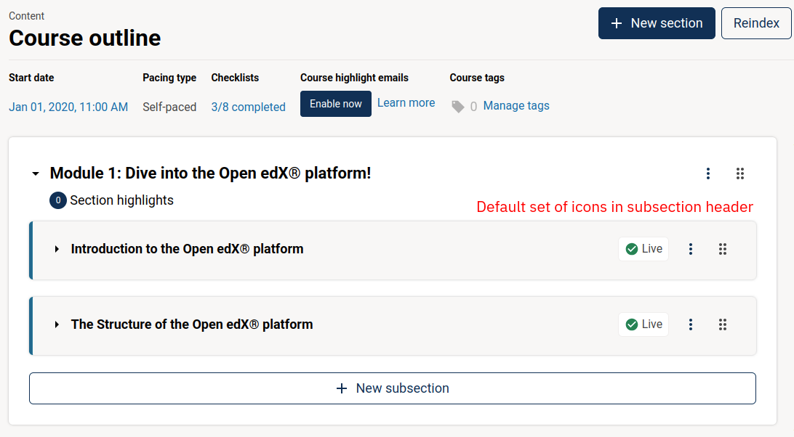
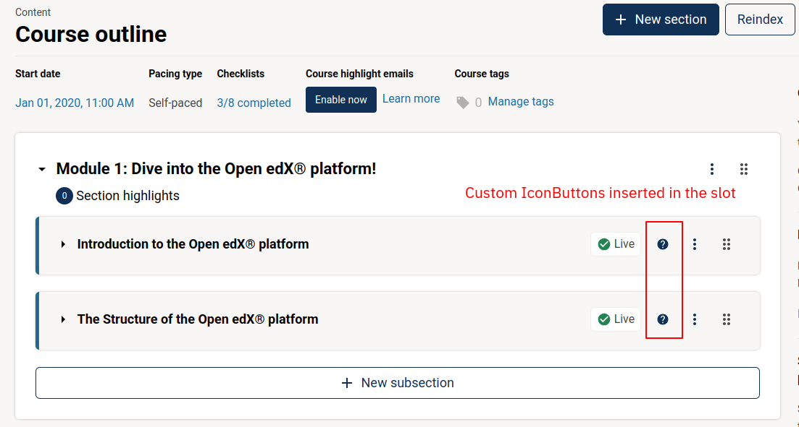

# CourseOutlineSubsectionCardExtraActionsSlot

### Slot ID: `org.openedx.frontend.authoring.course_outline_subsection_card_extra_actions.v1`

### Slot ID Aliases
* `course_outline_subsection_card_extra_actions_slot`

### Plugin Props:

* `section` - object
* `subsection` - object

See the `PropTypes` definition in the slot for the attributes available in each of these objects.

## Description

The slot is positioned right before the drop-down menu icon in the sub-section cards of the Course Outline page.
It is best suited for adding icon buttons.

The slot by default is empty.

## Example

Default view of the Subsection Cards



The subsection with a custom icon-button inserted in the slot.



```js
import { DIRECT_PLUGIN, PLUGIN_OPERATIONS } from '@openedx/frontend-plugin-framework';
import { IconButton } from '@openedx/paragon';
import { Help } from '@openedx/paragon/icons';

const MyIconButton = () => (
  <IconButton iconAs={Help} />
);

const config = {
  pluginSlots: {
    'org.openedx.frontend.authoring.course_outline_subsection_card_extra_actions.v1': {
      keepDefault: true,
      plugins: [
        {
          op: PLUGIN_OPERATIONS.Insert,
          widget: {
            id: 'my-extra-icon',
            priority: 60,
            type: DIRECT_PLUGIN,
            RenderWidget: MyIconButton,
          },
        },
      ]
    }
  },
}

export default config;
```
