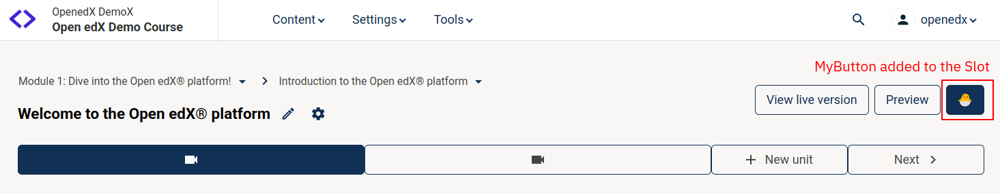

# CourseUnitHeaderActionsSlot

### Slot ID: `org.openedx.frontend.authoring.course_unit_header_actions.v1`

### Slot ID Aliases
* `course_unit_header_actions_slot`

### Plugin Props:

* `headerNavigationsActions` - Object. See the prop-types definition in the component for details.
* `category` - String.
* `unitTitle` - String. Title of the Unit
* `isUnitVerticalType` - Boolean. Flag indicating if the Unit is VerticalBlock type. It's false for others like Library Blocks.
* `verticalBlocks` - Array. List of the vertical blocks.

## Description

The slot is positioned in the `SubHeader` section of the Course Unit editor page. It is suitable for adding action buttons.

By default, the slot contains the action buttons like **View Live Version** and **Preview**.

## Example



The following example configuration inserts an extra button to the header as shown above.

```js
import { DIRECT_PLUGIN, PLUGIN_OPERATIONS } from '@openedx/frontend-plugin-framework';
import { Button } from '@openedx/paragon';

const MyButton = () => (
  <Button>🐣</Button>
);

const config = {
  pluginSlots: {
    'org.openedx.frontend.authoring.course_unit_header_actions.v1': {
      keepDefault: true,
      plugins: [
        {
          op: PLUGIN_OPERATIONS.Insert,
          widget: {
            id: 'my-extra-button',
            priority: 60,
            type: DIRECT_PLUGIN,
            RenderWidget: MyButton,
          },
        },
      ]
    }
  },
}

export default config;
```
