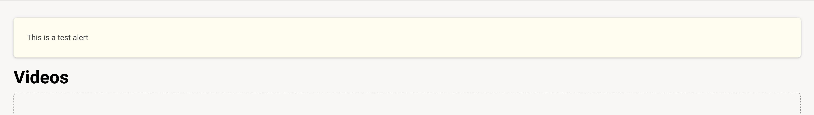

# Videos Page Alerts Slot

### Slot ID: `org.openedx.frontend.authoring.edit_video_alerts.v1`

## Description

This slot is used to add alerts to the course video edit page.

## Example

### Additional Alert on Videos Page



The following `env.config.jsx` will display an additional custom alert on the videos page.

```js
import { DIRECT_PLUGIN, PLUGIN_OPERATIONS } from '@openedx/frontend-plugin-framework';
import { Alert } from '@openedx/paragon';

const config = {
  pluginSlots: {
    'org.openedx.frontend.authoring.edit_video_alerts.v1': {
      keepDefault: true,
      plugins: [
        {
          op: PLUGIN_OPERATIONS.Insert,
          widget: {
            id: 'test-alert',
            type: DIRECT_PLUGIN,
            RenderWidget: () => (
              <Alert variant="warning">
                This is a test alert
              </Alert>
            )
          }
        },
      ]
    }
  },
}

export default config;
```
