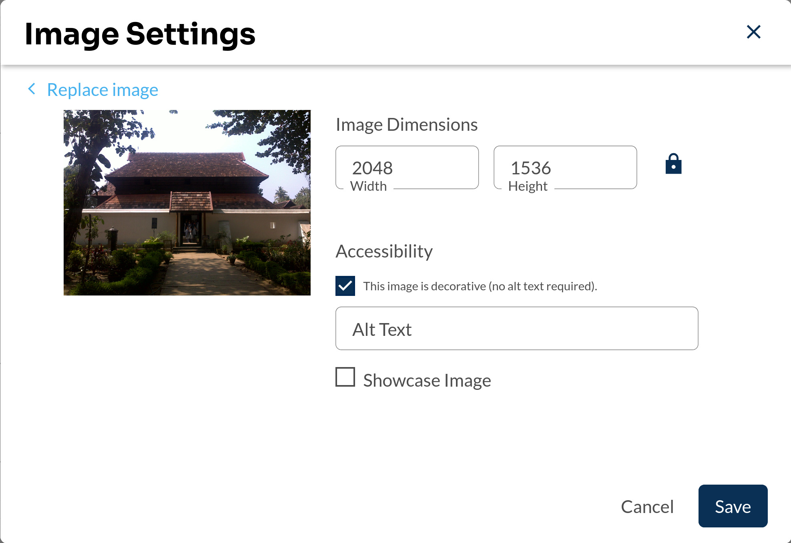

# Image Additional Settings Slot

### Slot ID: `org.openedx.frontend.authoring.image_additional_settings.v1`

## Description

This slot is used to add additional settings to the image settings modal.

## Example

The following `env.config.jsx` will add a checkbox that will apply or remove the 'showcase' class to the selected image.



```jsx
import { PLUGIN_OPERATIONS } from '@openedx/frontend-plugin-framework';
import { Form } from '@openedx/paragon';
import { useFormikContext } from 'formik';
import React from 'react';

const ShowcaseClassEditor = () => {
  const formik = useFormikContext();
  const { classList } = formik.values;

  const checked = classList.includes('showcase');

  const handleChange = async (event) => {
    // Toggle the 'showcase' class based on the checkbox state
    const filteredList = classList.filter(c => c !== 'showcase');
    const newList = event.target.checked
      ? [...filteredList, "showcase"]
      : filteredList;
    await formik.setFieldValue('classList', newList);
  };

  return (
    <Form.Group>
      <Form.Checkbox
        checked={checked}
        onChange={handleChange}
      />
      <Form.Label>Showcase Image</Form.Label>
    </Form.Group>
  );
};

const config = {
  pluginSlots: {
    'org.openedx.frontend.authoring.image_additional_settings.v1': {
      plugins: [
        {
          op: PLUGIN_OPERATIONS.Insert,
          widget: {
            id: 'showcase_class_editor',
            type: 'DIRECT_PLUGIN',
            RenderWidget: ShowCaseClassEditor,
          },
        },
      ],
    },
  },
};

export default config;
```
