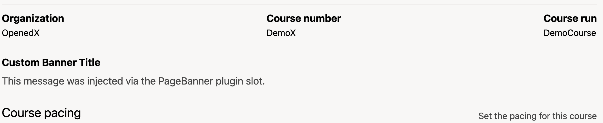

# Page Banner Slot

### Slot ID: `org.openedx.frontend.authoring.page_banner.v1`

### Slot ID Aliases
* `page_banner_slot`

## Description

This slot wraps the Paragon `PageBanner` component to allow plugins to replace, modify, or hide the banner shown on pages like Schedule & Details. By default, it renders the standard `PageBanner` with the provided props and children.

## Example

The following `env.config.jsx` example replaces the default banner message with a custom message.



```jsx
import { DIRECT_PLUGIN, PLUGIN_OPERATIONS } from '@openedx/frontend-plugin-framework';

const config = {
  pluginSlots: {
    'org.openedx.frontend.authoring.page_banner.v1': {
      plugins: [
        {
          // Hide the default banner contents
          op: PLUGIN_OPERATIONS.Hide,
          widgetId: 'default_contents',
        },
        {
          // Insert a custom banner contents
          op: PLUGIN_OPERATIONS.Insert,
          widget: {
            id: 'custom_page_banner_contents',
            type: DIRECT_PLUGIN,
            RenderWidget: () => (
              <>
                <h4 className="text-black">Custom Banner Title</h4>
                <span className="text text-gray-700 text-left">
                  This message was injected via the PageBanner plugin slot.
                </span>
              </>
            ),
          },
        },
      ],
    },
  },
};

export default config;
```