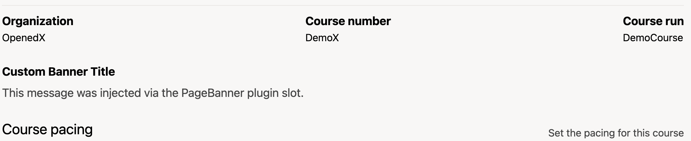

# Page Banner Slot

### Slot ID: `org.openedx.frontend.authoring.page_banner.v1`

### Slot ID Aliases

- `page_banner_slot`

## Description

This slot wraps the Paragon `PageBanner` component to allow plugins to replace, modify, or hide the banner shown on pages like Schedule & Details. By default, it renders the standard `PageBanner` with the provided props and children.

### Plugin Props:

- `show` - Boolean. Whether the banner is currently shown.
- `onDismiss` - Function. Callback invoked when the banner is dismissed.
- `lmsLinkForAboutPage` - String. URL of the course about page on the LMS.
- `courseDisplayName` - String. The course's display name.
- `platformName` - String. The platform name configured for the site.
- `isEditable` - Boolean. Whether the current user can edit the Schedule & Details page. Pass it to `CoursePromotionCard` to disable the "Invite your students" mailto link for view-only users.

## Example

The following `env.config.jsx` example replaces the default banner message with a custom message.



```jsx
import { DIRECT_PLUGIN, PLUGIN_OPERATIONS } from '@openedx/frontend-plugin-framework';

const config = {
  pluginSlots: {
    'org.openedx.frontend.authoring.page_banner.v1': {
      plugins: [
        {
          // Hide the default banner contents
          op: PLUGIN_OPERATIONS.Hide,
          widgetId: 'default_contents',
        },
        {
          // Insert a custom banner contents
          op: PLUGIN_OPERATIONS.Insert,
          widget: {
            id: 'custom_page_banner_contents',
            type: DIRECT_PLUGIN,
            RenderWidget: () => (
              <>
                <h4 className="text-black">Custom Banner Title</h4>
                <span className="text text-gray-700 text-left">
                  This message was injected via the PageBanner plugin slot.
                </span>
              </>
            ),
          },
        },
      ],
    },
  },
};

export default config;
```

## Restoring the course enrollment card

Prior to the removal of `ENABLE_MKTG_SITE`, deployments running with `ENABLE_MKTG_SITE=False`
showed a "Course summary page" card in Schedule & Details instead of the promotional banner.
That card displayed a direct link to the LMS about/enrollment page and an "Invite your students"
mailto button.

If you want to restore that experience, you can use `CoursePromotionCard` — exported from
`basic-section` — via this slot. The slot passes `lmsLinkForAboutPage`, `courseDisplayName`,
`platformName`, and `isEditable` as plugin props so the card has everything it needs. The
`isEditable` prop disables the "Invite your students" mailto button for users with view-only
access to Schedule & Details.

```jsx
import { DIRECT_PLUGIN, PLUGIN_OPERATIONS } from '@openedx/frontend-plugin-framework';
import { CoursePromotionCard } from '@edx/frontend-app-authoring/src/schedule-and-details/basic-section';

const config = {
  pluginSlots: {
    'org.openedx.frontend.authoring.page_banner.v1': {
      plugins: [
        {
          op: PLUGIN_OPERATIONS.Hide,
          widgetId: 'default_contents',
        },
        {
          op: PLUGIN_OPERATIONS.Insert,
          widget: {
            id: 'course_promotion_card',
            type: DIRECT_PLUGIN,
            RenderWidget: ({ lmsLinkForAboutPage, courseDisplayName, platformName, isEditable }) => (
              <CoursePromotionCard
                lmsLinkForAboutPage={lmsLinkForAboutPage}
                courseDisplayName={courseDisplayName}
                platformName={platformName}
                isEditable={isEditable}
              />
            ),
          },
        },
      ],
    },
  },
};
```
