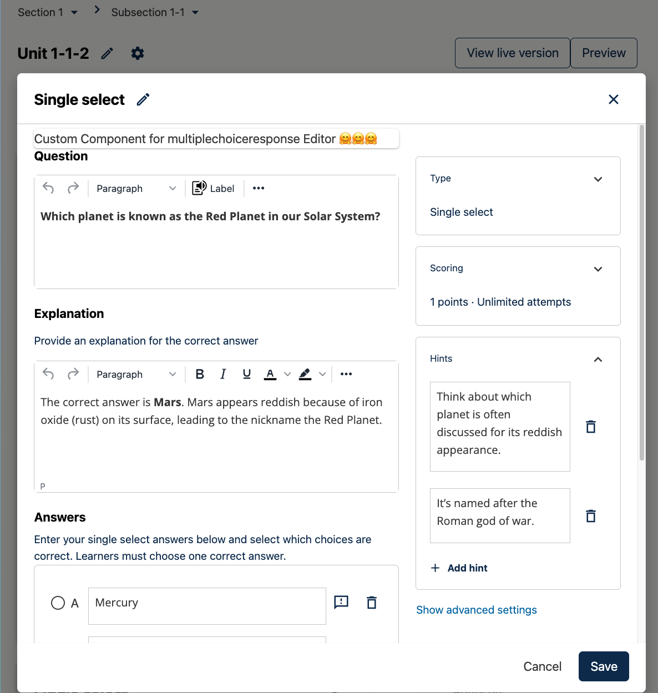

# ProblemEditorPluginSlot

### Slot ID: `org.openedx.frontend.authoring.problem_editor_plugin.v1`

### Slot ID Aliases
* `problem_editor_plugin_slot`

### Plugin Props:

* `blockType` - String. The type of problem block being edited (e.g., `problem-single-select`, `problem-multi-select`, `problem`, `advanced`).

## Description

The `ProblemEditorPluginSlot` is rendered inside the Problem Editor modal window for all major
problem XBlock types:

- single-select
- multi-select
- dropdown
- numerical-input
- text-input

It is a **generic extension point** that can host any React component, such as:

- **Problem authoring helpers** (validation, hints, accessibility tips)
- **Preview or analysis tools** (show how a problem will render, check grading logic)
- **Integrations** (external content sources, tagging, metadata editors)

By default, the slot is **empty**. Widgets are attached via `env.config.jsx` using the
`@openedx/frontend-plugin-framework`.

The only prop your component receives from the slot is:

- `blockType` – the current problem block type.

Your component is responsible for interacting with the editor state (if needed) using
Redux, `window.tinymce`, CodeMirror, or other utilities provided by `frontend-app-authoring`.

The slot is available in the **visual editor** mode. Advanced / raw editing is handled
by the raw editor, and your component can still interact with the underlying state
if it chooses to.

## Example: Adding a component into `ProblemEditorPluginSlot`

The following example configuration shows how to add a custom widget to the slot:

```jsx
import { DIRECT_PLUGIN, PLUGIN_OPERATIONS } from '@openedx/frontend-plugin-framework';
import { MyProblemEditorHelper } from '@example/my-problem-editor-helper';

const config = {
  pluginSlots: {
    'org.openedx.frontend.authoring.problem_editor_plugin.v1': {
      plugins: [
        {
          op: PLUGIN_OPERATIONS.Insert,
          widget: {
            id: 'my-problem-editor-helper',
            type: DIRECT_PLUGIN,
            priority: 1,
            RenderWidget: MyProblemEditorHelper,
          },
        },
      ]
    }
  },
}

export default config;
```

## Example: Custom Implementation

The following example shows a minimal helper component that uses `blockType`:

```jsx
import { DIRECT_PLUGIN, PLUGIN_OPERATIONS } from '@openedx/frontend-plugin-framework';
import { Card } from '@openedx/paragon';

const CustomProblemAssistant = ({ blockType }) => {
  // Your custom implementation (example)
  return (
    <Card>
      <Card.Body>
        Custom component for {blockType} problem editor 🤗🤗🤗
      </Card.Body>
    </Card>
  );
};

const config = {
  pluginSlots: {
    'org.openedx.frontend.authoring.problem_editor_plugin.v1': {
      plugins: [
        {
          op: PLUGIN_OPERATIONS.Insert,
          widget: {
            id: 'custom-problem-editor-assistant',
            priority: 1,
            type: DIRECT_PLUGIN,
            RenderWidget: CustomProblemAssistant,
          },
          op: PLUGIN_OPERATIONS.Insert,
        },
      ]
    }
  },
}

export default config;
```

### Example: Screenshots

**Default problem editor without a widget**


**With a widget rendered in the slot**



