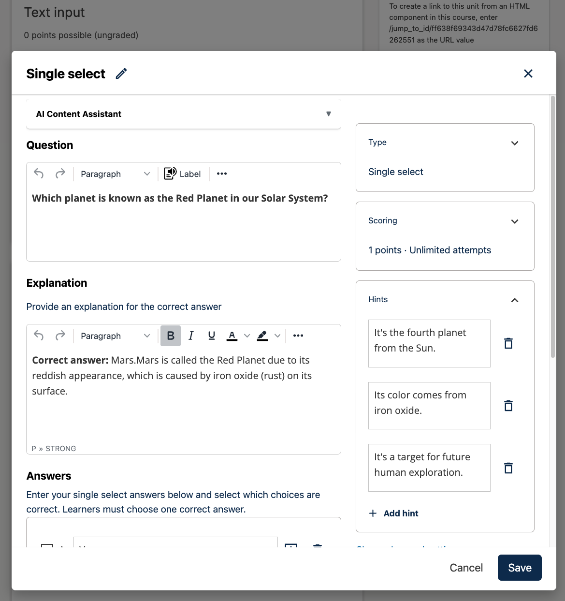
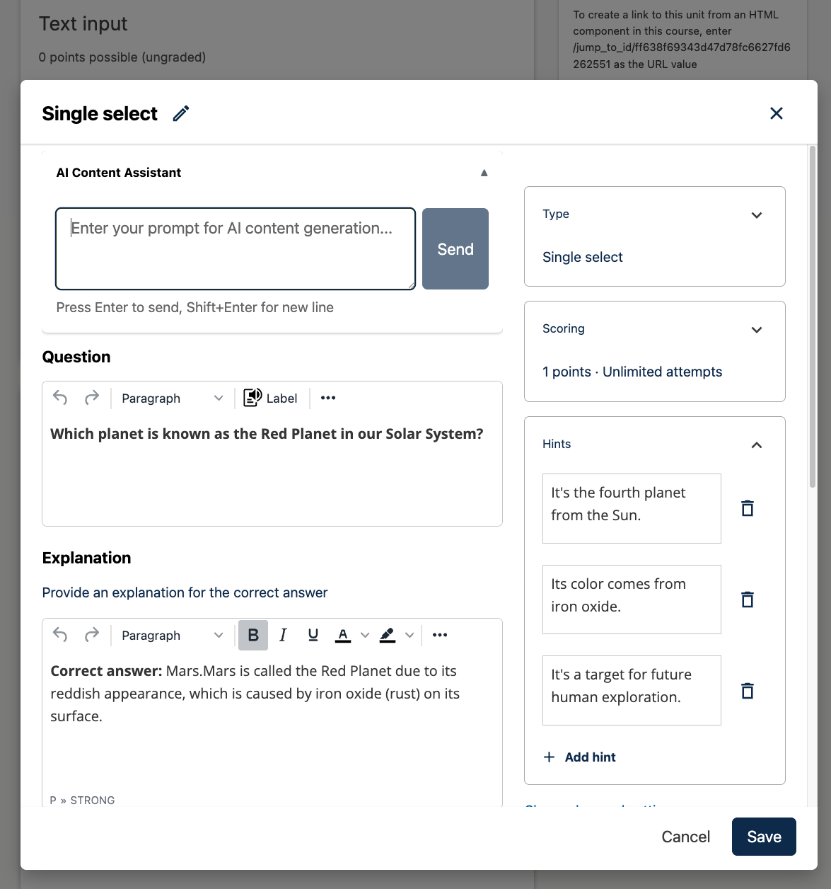
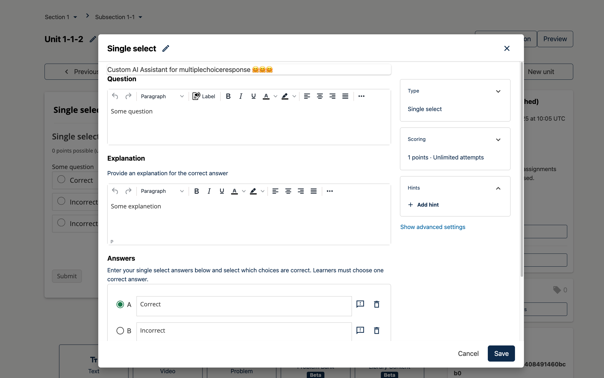

# ProblemEditorPluginSlot

### Slot ID: `org.openedx.frontend.authoring.problem_editor_plugin.v1`

### Slot ID Aliases
* `problem_editor_plugin_slot`

### Plugin Props:

* `updateContent` - Function. Updates the editor content with the provided string. For visual editors, this should parse the OLX and update the problem state. For advanced editors, this updates the raw editor content.
* `blockType` - String. The type of problem block being edited (e.g., 'problem-single-select', 'problem-multi-select', 'problem', 'advanced').

## Description

The slot is positioned in the Problem Editor modal window for all problem xBlock types (single-select, multi-select, dropdown, numerical-input, text-input, and advanced). It is suitable for adding AI-powered content generation tools or other editor enhancements.

By default, the slot is **empty**. Add widgets via `env.config.jsx`.

The slot is available in both:
- **Visual Editor Mode**: Where the widget can generate OLX content that is parsed and loaded into the visual editor components.
- **Advanced/Raw Editor Mode**: Where the widget can generate raw OLX or Markdown content that is directly inserted into the CodeMirror editor.

## Example: Adding the AI Content Assistant

The following example configuration shows how to add the built-in AI Content Assistant widget:

```jsx
import { DIRECT_PLUGIN, PLUGIN_OPERATIONS } from '@openedx/frontend-plugin-framework';
import AIAssistantWidget from './src/editors/sharedComponents/AIAssistantWidget';

const config = {
  pluginSlots: {
    'org.openedx.frontend.authoring.problem_editor_plugin.v1': {
      plugins: [
        {
          op: PLUGIN_OPERATIONS.Insert,
          widget: {
            id: 'ai-content-assistant',
            type: DIRECT_PLUGIN,
            priority: 1,
            RenderWidget: AIAssistantWidget,
          },
        },
      ]
    }
  },
}

export default config;
```
## Example: Screenshots with implemented `AIAssistantWidget` for Problem editor




## Example: Custom Implementation

The following example configuration shows how to add a custom AI assistant:

```jsx
import { DIRECT_PLUGIN, PLUGIN_OPERATIONS } from '@openedx/frontend-plugin-framework';
import { Card } from '@openedx/paragon';

const CustomProblemAssistant = ({ updateContent, blockType }) => {
  // Your custom AI assistant implementation
  // updateContent(newContent) updates the editor with new content
  return (
    <Card>
      <Card.Body>
        Custom Problem Assistant for {blockType}
      </Card.Body>
    </Card>
  );
};

const config = {
  pluginSlots: {
    'org.openedx.frontend.authoring.problem_editor_plugin.v1': {
      plugins: [
        {
          op: PLUGIN_OPERATIONS.Insert,
          widget: {
            id: 'custom-problem-editor-assistant',
            priority: 1,
            type: DIRECT_PLUGIN,
            RenderWidget: CustomProblemAssistant,
          },
        },
      ]
    }
  },
}

export default config;
```

## Example: Screenshot with custom implementation



## Notes

- The `updateContent` function behavior differs between visual and advanced editor modes:
  - **Visual Editor**: The function should parse the OLX content and update the entire problem state using Redux actions.
  - **Advanced Editor**: The function should directly update the CodeMirror editor content.
- The `blockType` prop may be in different formats:
  - API format: `problem-single-select`, `problem-multi-select`, etc.
  - OLX format: `multiplechoiceresponse`, `choiceresponse`, etc.
  - Generic: `problem`, `advanced`

