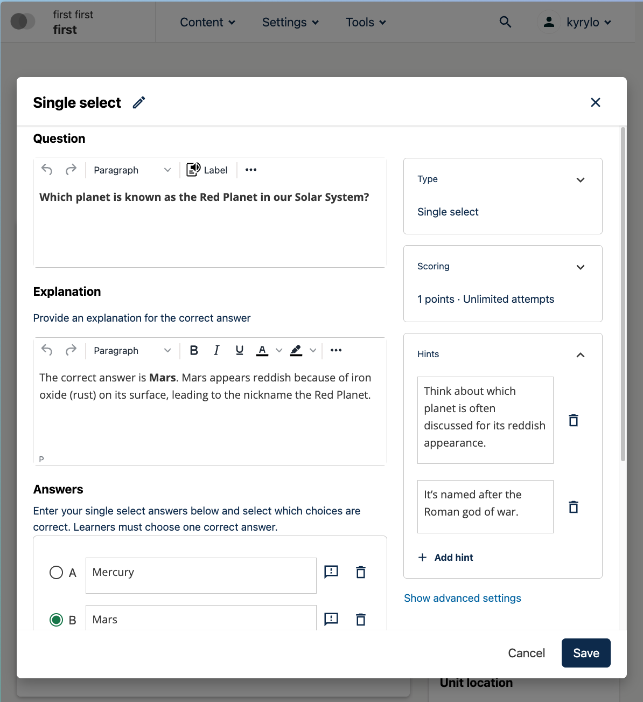
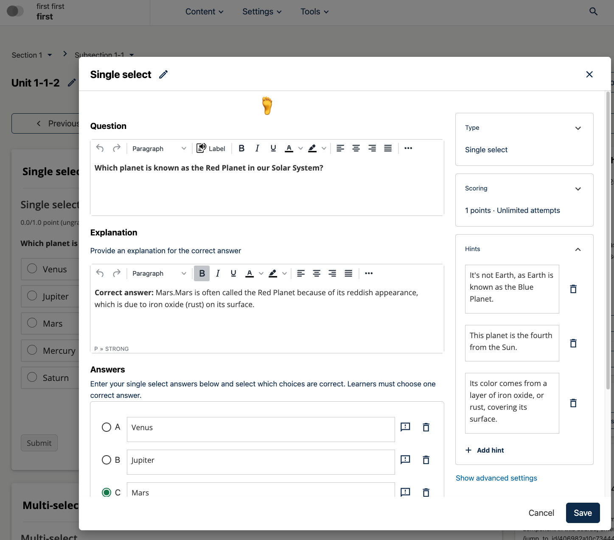
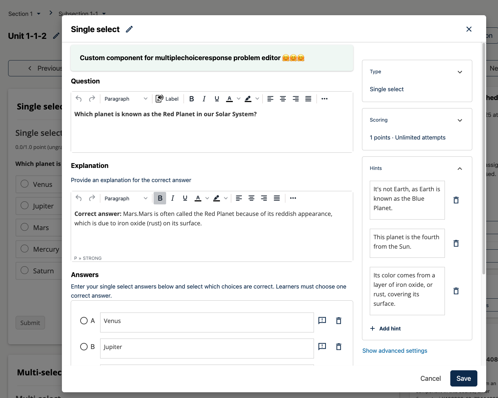

# ProblemEditorPluginSlot

### Slot ID: `org.openedx.frontend.authoring.problem_editor_plugin.v1`

### Slot ID Aliases
* `problem_editor_plugin_slot`

### Plugin Props:

* `blockType` - String. The type of problem block being edited (e.g., `problem-single-select`, `problem-multi-select`, `problem`, `advanced`).

## Description

The `ProblemEditorPluginSlot` is rendered inside the Problem Editor modal window for all major
problem XBlock types:

* single-select
* multi-select
* dropdown
* numerical-input
* text-input

It is a **generic extension point** that can host any React component, such as:

- **Problem authoring helpers** (validation, hints, accessibility tips)
- **Preview or analysis tools** (show how a problem will render, check grading logic)
- **Integrations** (external content sources, tagging, metadata editors)

Your component is responsible for interacting with the editor state (if needed) using
Redux, `window.tinymce`, CodeMirror, or other utilities provided by `frontend-app-authoring`.

#### Interacting with Editor State (Reading State from Redux)

```jsx
import { useSelector } from 'react-redux';
import { selectors } from 'CourseAuthoring/editors/data/redux';

const MyComponent = ({ blockType }) => {
  // Read problem state
  const problemState = useSelector(selectors.problem.completeState);
  const learningContextId = useSelector(selectors.app.learningContextId);
  const showRawEditor = useSelector(selectors.app.showRawEditor);
  
  // Access problem data
  const question = problemState?.question || '';
  const answers = problemState?.answers || [];
  
  return <div>Question: {question}</div>;
};
```

## Examples

### Default content



### Replaced with custom component

The following `env.config.tsx` will add a centered `h1` tag im Problem editor.



```tsx
import { DIRECT_PLUGIN, PLUGIN_OPERATIONS } from '@openedx/frontend-plugin-framework';

const config = {
  pluginSlots: {
    'org.openedx.frontend.authoring.problem_editor_plugin.v1': {
      plugins: [
        {
          op: PLUGIN_OPERATIONS.Insert,
          widget: {
            id: 'my-problem-editor-helper',
            type: DIRECT_PLUGIN,
            RenderWidget: () => (
              <h1 style={{ textAlign: 'center' }}>🦶</h1>
            ),
          },
        },
      ]
    }
  },
}

export default config;
```

### Custom component with plugin props



The following `env.config.tsx` example demonstrates how to add a custom component to the Problem Editor plugin slot that receives the plugin props. The example shows a Paragon Alert component that renders the current `blockType` provided by the slot:

```jsx
import { DIRECT_PLUGIN, PLUGIN_OPERATIONS } from '@openedx/frontend-plugin-framework';
import { Alert } from '@openedx/paragon';

const config = {
  pluginSlots: {
    'org.openedx.frontend.authoring.problem_editor_plugin.v1': {
      plugins: [
        {
          op: PLUGIN_OPERATIONS.Insert,
          widget: {
            id: 'custom-problem-editor-assistant',
            priority: 1,
            type: DIRECT_PLUGIN,
            RenderWidget: ({ blockType }) => {
              return (
                <Alert variant="success">
                  <Alert.Heading>Custom component for {blockType} problem editor 🤗🤗🤗</Alert.Heading>
                </Alert>
              );
            },
          },
          op: PLUGIN_OPERATIONS.Insert,
        },
      ]
    }
  },
}

export default config;
```
