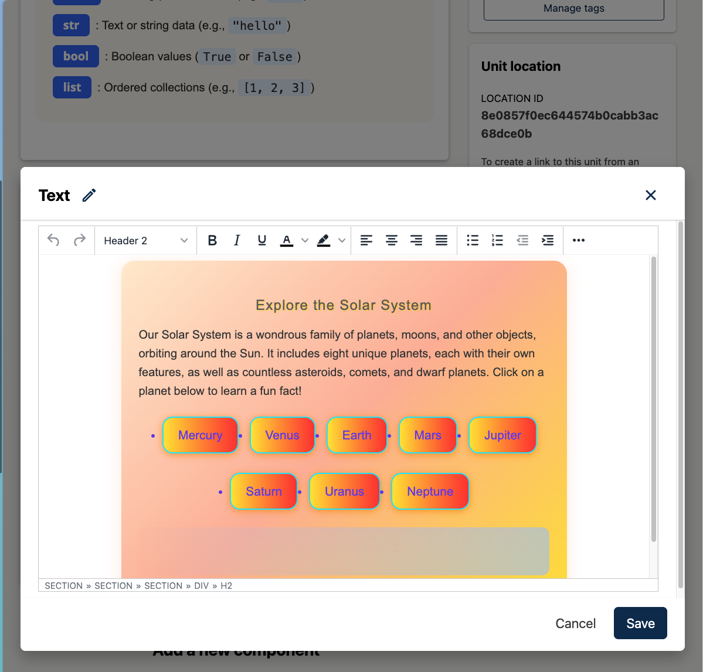
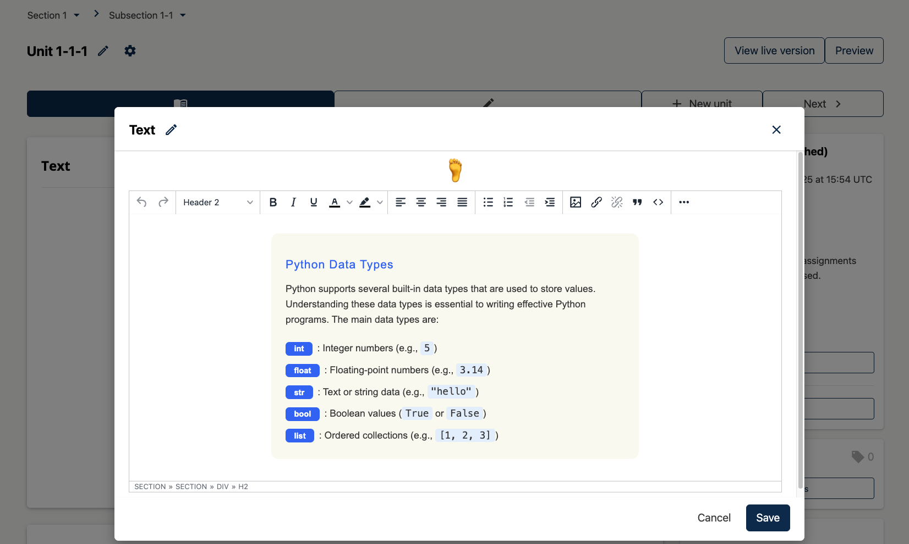
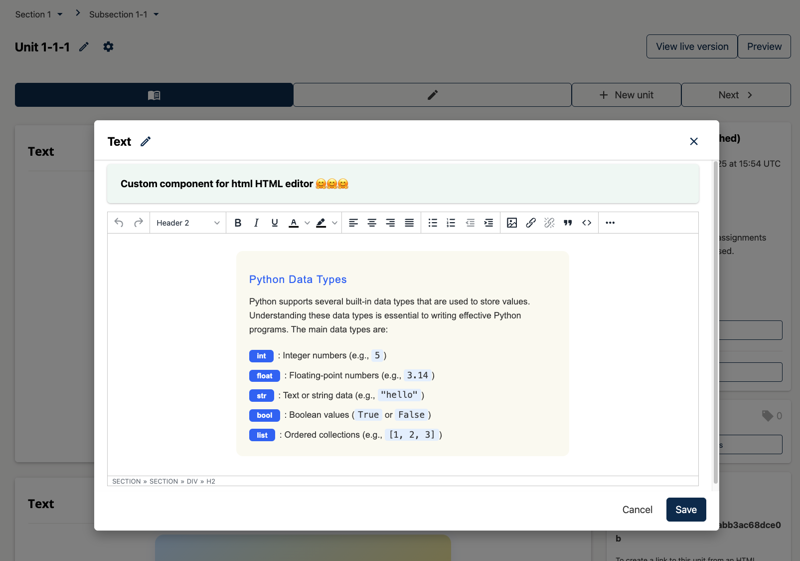

# TextEditorPluginSlot

### Slot ID: `org.openedx.frontend.authoring.text_editor_plugin.v1`

### Slot ID Aliases
* `text_editor_plugin_slot`

### Plugin Props:

* `blockType` - String. The type of block being edited (e.g., `html`).

## Description

The `TextEditorPluginSlot` is rendered inside the Text Editor modal window for HTML XBlocks.
It is intended as a generic extension point that can host **any React component** – for example:

- **Contextual helpers** (tips, validation messages, writing guides)
- **Content utilities** (templates, reusable snippets, glossary insert tools)
- **Integrations** (linking to external systems, analytics, metadata editors)

By default, the slot is **empty**. Widgets are attached via `env.config.jsx` using the
`@openedx/frontend-plugin-framework`.

The only prop your component receives from the slot is:

- `blockType` – the current editor block type (for this slot it will typically be `html`).

Your component is responsible for interacting with the editor (if needed) using Redux state,
DOM APIs, or other utilities provided by `frontend-app-authoring`.

## Examples

### Default content



### Replaced with custom component

The following `env.config.tsx` will add a centered `h1` tag im HTML editor.



```tsx
import { DIRECT_PLUGIN, PLUGIN_OPERATIONS } from '@openedx/frontend-plugin-framework';

const config = {
  pluginSlots: {
    'org.openedx.frontend.authoring.text_editor_plugin.v1': {
      plugins: [
        {
          op: PLUGIN_OPERATIONS.Insert,
          widget: {
            id: 'my-html-editor-helper',
            type: DIRECT_PLUGIN,
            RenderWidget: () => (
              <h1 style={{ textAlign: 'center' }}>🦶</h1>
            ),
          },
        },
      ]
    }
  },
}

export default config;
```

### Custom component with plugin props



The following `env.config.tsx` example demonstrates how to add a custom component to the HTML Editor plugin slot that receives the plugin props. The example shows a Paragon Alert component that renders the current `blockType` provided by the slot:

```jsx
import { DIRECT_PLUGIN, PLUGIN_OPERATIONS } from '@openedx/frontend-plugin-framework';
import { Alert } from '@openedx/paragon';

const config = {
  pluginSlots: {
    'org.openedx.frontend.authoring.text_editor_plugin.v1': {
      plugins: [
        {
          op: PLUGIN_OPERATIONS.Insert,
          widget: {
            id: 'custom-html-editor-assistant',
            priority: 1,
            type: DIRECT_PLUGIN,
            RenderWidget: ({ blockType }) => {
              return (
                <Alert variant="success">
                  <Alert.Heading>Custom component for {blockType} HTML editor 🤗🤗🤗</Alert.Heading>
                </Alert>
              );
            },
          },
          op: PLUGIN_OPERATIONS.Insert,
        },
      ]
    }
  },
}

export default config;
```
