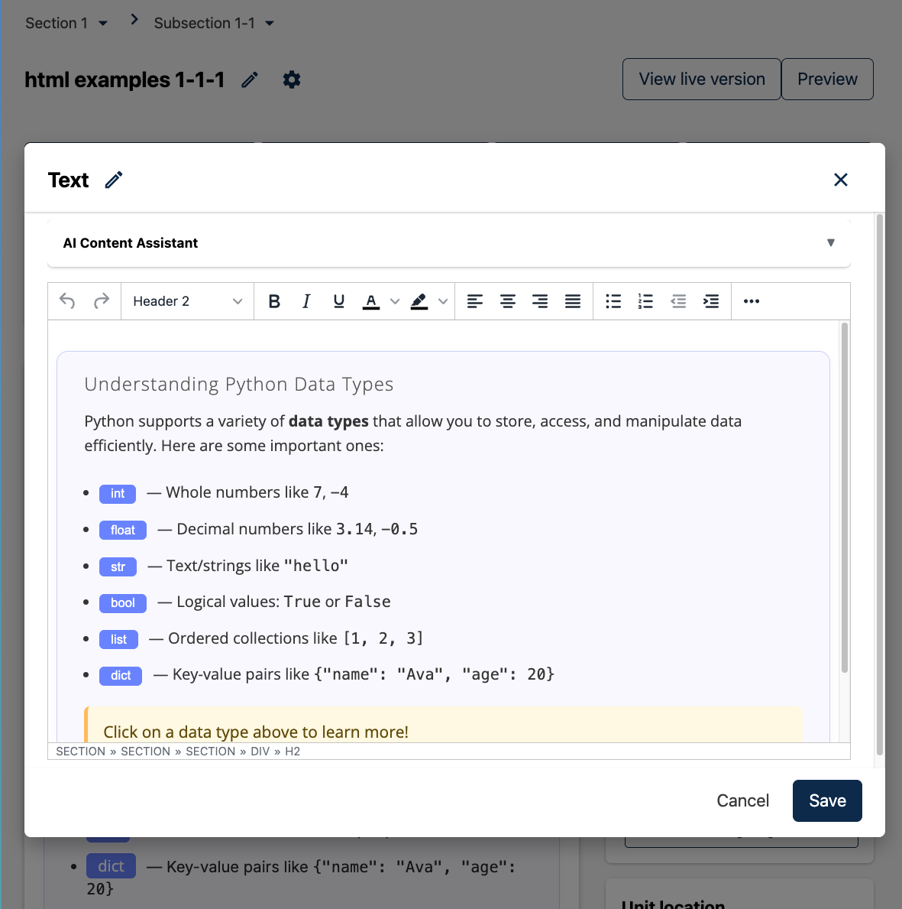
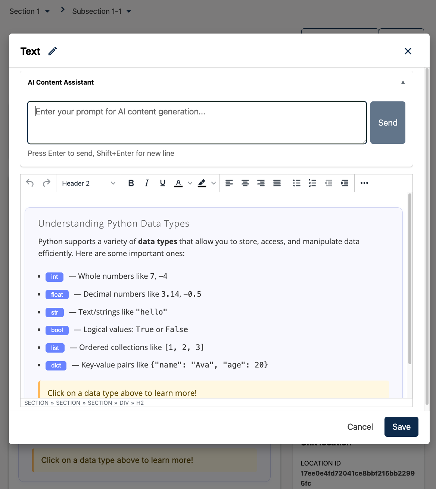
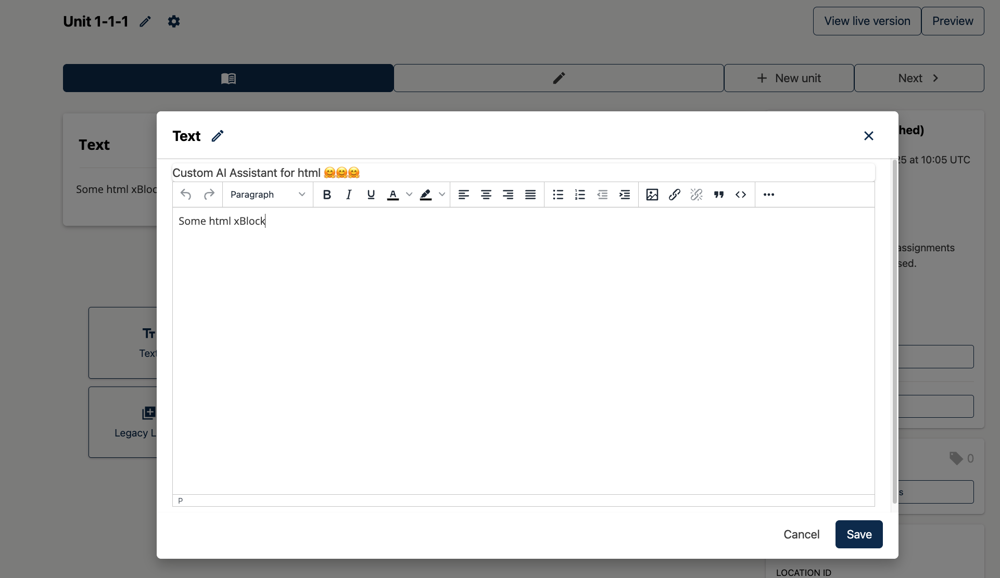

# TextEditorPluginSlot

### Slot ID: `org.openedx.frontend.authoring.text_editor_plugin.v1`

### Slot ID Aliases
* `text_editor_plugin_slot`

### Plugin Props:

* `updateContent` - Function. Updates the editor content with the provided string.
* `blockType` - String. The type of block being edited (e.g., 'html').

## Description

The slot is positioned in the Text Editor modal window for HTML xBlocks. It is suitable for adding AI-powered content generation tools or other editor enhancements.

By default, the slot is **empty**. Add widgets via `env.config.jsx`.

## Example: Adding the AI Content Assistant

The following example configuration shows how to add the built-in AI Content Assistant widget:

```jsx
import { DIRECT_PLUGIN, PLUGIN_OPERATIONS } from '@openedx/frontend-plugin-framework';
import AIAssistantWidget from './src/editors/sharedComponents/AIAssistantWidget';

const config = {
  pluginSlots: {
    'org.openedx.frontend.authoring.text_editor_plugin.v1': {
      plugins: [
        {
          op: PLUGIN_OPERATIONS.Insert,
          widget: {
            id: 'ai-content-assistant',
            type: DIRECT_PLUGIN,
            priority: 1,
            RenderWidget: AIAssistantWidget,
          },
        },
      ]
    }
  },
}

export default config;
```

## Example: Screenshots with implemented `AIAssistantWidget` for HTML editor



## Example: Custom Implementation

The following example configuration shows how to add a custom AI assistant:

```jsx
import { DIRECT_PLUGIN, PLUGIN_OPERATIONS } from '@openedx/frontend-plugin-framework';
import { Card } from '@openedx/paragon';

const CustomAIAssistant = ({ updateContent, blockType }) => {
  // Your custom AI assistant implementation
  return (
    <Card>
      <Card.Body>
        Custom AI Assistant for {blockType}
      </Card.Body>
    </Card>
  );
};

const config = {
  pluginSlots: {
    'org.openedx.frontend.authoring.text_editor_plugin.v1': {
      plugins: [
        {
          op: PLUGIN_OPERATIONS.Insert,
          widget: {
            id: 'custom-text-editor-assistant',
            priority: 1,
            type: DIRECT_PLUGIN,
            RenderWidget: CustomAIAssistant,
          },
        },
      ]
    }
  },
}

export default config;
```

## Example: Screenshot with custom implementation

